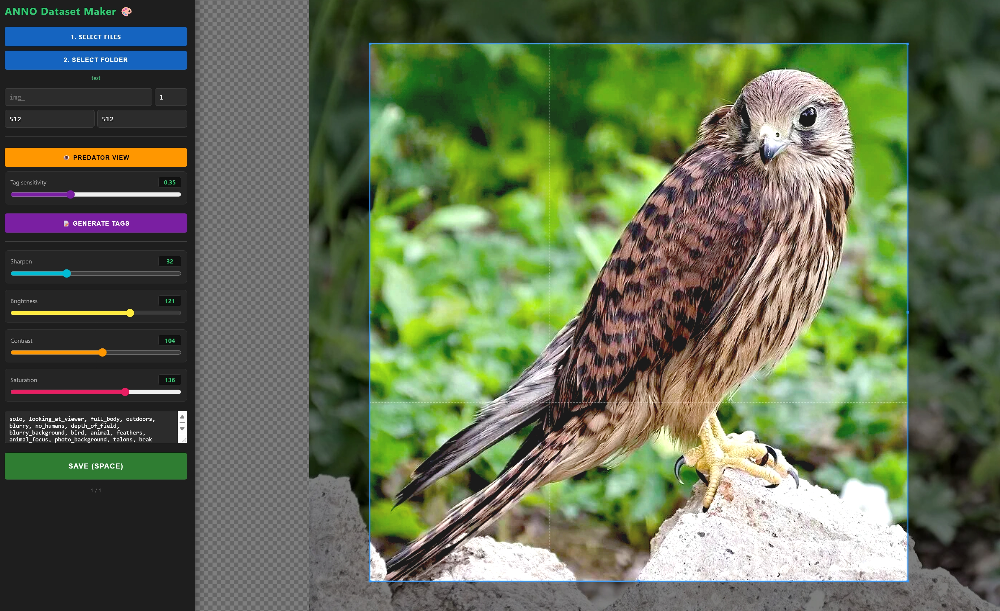
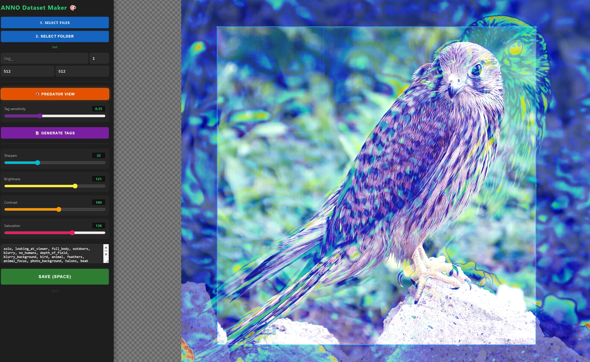

# ANNO Dataset Maker

ANNO Dataset Maker is a small local web tool for preparing AI image datasets. It helps crop images, apply quick visual adjustments, generate WD14 tags, preview saliency heatmaps, and save paired `.png` + `.txt` files for training datasets.

## Screenshots





## Features

- Batch image loading
- Manual crop with fixed output size
- PNG export
- Optional `.txt` caption/tag export
- WD14 tag generation through ONNX Runtime
- Adjustable tag threshold
- Saliency heatmap preview
- Brightness, contrast, saturation, and sharpen controls
- Local browser-based UI
- Works as a simple Flask app

## Project Structure

```text
ANNO_Dataset_Maker/
├─ app.py
├─ get_models.py
├─ get_models.bat
├─ run.bat
├─ requirements.txt
├─ README.md
├─ .gitignore
├─ models/
│  ├─ model.onnx
│  └─ wd14_tags.csv
└─ templates/
   └─ index.html
```

## Installation

Install Python 3.10 or newer.

Install dependencies:

```bash
pip install -r requirements.txt
```

On Windows, you can also run:

```bat
get_models.bat
run.bat
```

## Model Setup

The tool expects the WD14 model files here:

```text
models/model.onnx
models/wd14_tags.csv
```

You have two options.

### Option 1: Download automatically

Run:

```bat
get_models.bat
```

or:

```bash
python get_models.py
```

This downloads the default SmilingWolf WD14 ONNX model and tag CSV into the `models` folder.

### Option 2: Add models manually

Create a folder named `models` in the project root and put your own files there:

```text
models/model.onnx
models/wd14_tags.csv
```

The app will load them automatically when it starts.

## Running

Start the app:

```bat
run.bat
```

or:

```bash
python app.py
```

Then open this address in your browser:

```text
http://127.0.0.1:5000
```

## Basic Workflow

1. Click `SELECT FILES` and choose your source images.
2. Click `SELECT OUTPUT FOLDER` and choose where processed files should be saved.
3. Set prefix, counter, width, and height.
4. Crop the image.
5. Optionally generate tags.
6. Optionally adjust brightness, contrast, saturation, or sharpen.
7. Click `SAVE` or press `Space`.
8. The app saves `.png` and, when tags are present, a matching `.txt` file.

Example output:

```text
img_1.png
img_1.txt
img_2.png
img_2.txt
```

## Notes

- The app runs locally.
- The `models` folder is ignored by Git because ONNX files are usually large.
- Generated datasets and image folders are ignored by default.
- If ONNX Runtime cannot use CUDA, the app falls back to CPU when possible.
- The browser must support the File System Access API for direct folder saving. Chromium-based browsers such as Chrome and Edge are recommended.

## Credits

Powered by ChatGPT and ANNO
